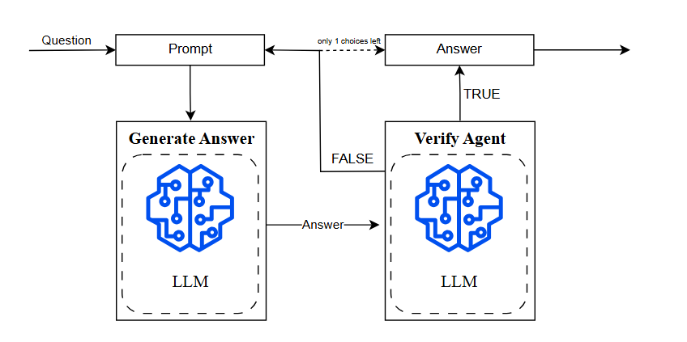
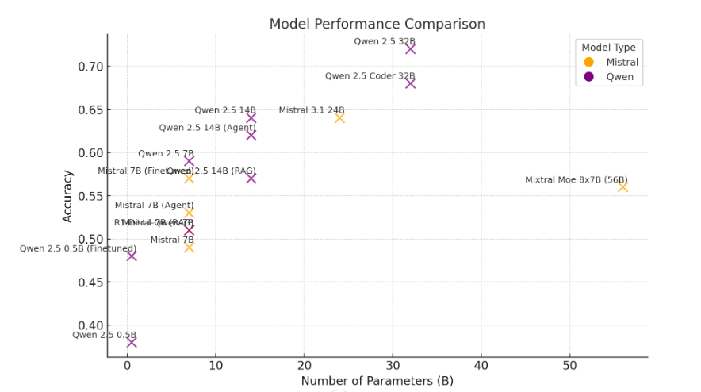

# LLMs defeat CodeMMLU

[](https://www.kaggle.com/)
[](https://huggingface.co/datasets/Fsoft-AIC/CodeMMLU)

This project is to find a way for LLM to outperform a subset of the CodeMMLU benchmark (FPT AI Residency).

# My solutions
- The CodeMMLU challenge is to develop an AI model that can answer multiple choice questions related to programming ability. Given a text input (question and options) and an alphanumeric output representing the answer, this is a natural language processing problem. The challenge is held on the Kaggle - a platform that supports tools such as notebooks and GPUs to develop AI/ML applications. 
- After thoroughly analyzing the challenge requirements and dataset, I adopted a large language model (LLM) approach. By implementing and evaluating various advanced techniques, including model finetuned, retrieval-augmented generation (RAG), autonomous agents, and model parallelism, I systematically optimized my model’s performance. Through extensive testing and submission evaluations, my approach yielded competitive results, demonstrating its effectiveness in tackling this complex NLP problem.

## 1. Prompting

Answer Template:

```
You are a programming expert and will answer multiple-choice questions about code.   
Read the following question and options carefully and select the **best** answer.   
 
### Response Format:
- Reply with **only** the letter of the correct choice (A, B, C, or D).
- Do **not** provide explanations.   
 
### {} 
 
### Options: 
{} 
 
### Response: 
```
Verify Template:

```
You are a programming expert and will verify the student's answer about code. 
Read the following question and verify 
 
### Response Format:
- Reply with **only** TRUE or FALSE
- Do **not** provide explanations.  
 
### Question: 
{} 
 
### Answer: 
{} 
 
### Response:
```

## 2. Agent Flow

The idea here is to let the model reconsider whether its answer is right or wrong and respond with a different answer. Consider the Agent's workflow: 



## 3. Finetune and Inference

- About Finetune:

Applying Quantization and Lora techniques, even with the limited resources provided by kaggle, we can still finetune the model in the range of 0 - 14B parameters. In addition, using advanced frameworks also greatly supports in saving resources, greatly speeding up training and inference.

- About Inference:

Applying Quantization, even with the limited resources provided by kaggle, we can still inference the model in the range under 60B parameters. I tried Mixtral 8x7B (56B), Qwen 2.5 32B,...

The frameworks I used in the experiment are:
- Unsloth: Inference and Finetuned models under 14B parameters
- VLLM: Inference larger models

## 4. RAG (Retrieval-Augmented Generation) 

With this technique, I will provide examples with answers relevant to the current question that the model needs to answer so that the model can make more accurate inferences. From the training data, I build a vector database with FAISS and query top_k when needed.

# Results Achieved and Analysis



Analysis in [Report](https://github.com/HiTrong/LLMdefeat_CodeMMLU/blob/main/Vo%20Hoai%20Trong%20-%20report.pdf)

# Improvement Idea

- Fine-tune with task-specific data by augmenting data or creating data synthesis
- Knowledge Augmentation: Hybrid RAG + Fine-tuning
- Mixture of Experts (MoE) Optimization
- Business Process Optimization (BPO) Fine-tuning
- Model Voting & Ranking: Enhancing Performance Through Model Collaboration

   
